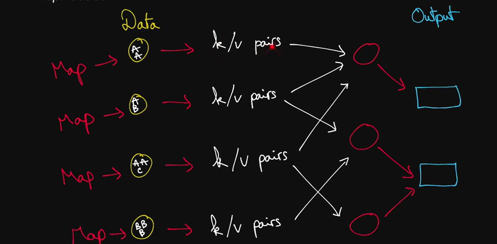

## History Of MapReduce:

Google was challenged with processing really large datasets in a distributed system in th early 2000. 
in 2004, two of google engineers came up with MapReduce model.

this was a process that allowed system administrator to process large dataset in a distributed system in an efficient and fault tolerant manner.

The premise was splitting the process into two steps 
- map
- reduce

## What is The MapReduce Model?

This is a popular framework for processing very large datasets in a distributed setting efficiently, quickly and in a fault tolerant manner. A mapReduce is composed of 3 main steps:
- The Map step which runs a map function on the various chunks of the dataset and transforms these chunks into intermediate key-value pairs
- The Shuffle step which reorganizes the intermediate key-value pairs such that pairs of the same key are routed to the same machine in the final step
- The Reduce step which ruins a reduce function on the newly shuffled key-value pairs and transform them into more meaningful data

The canonical example of a mapReduce use case is counting the number of occurrences of words iin a large text file.

When dealing with a MapReduce library, engineers system administrators only need to worry about the map and reduce functions as well as their input and outputs. All other concern including the parallelization of tasks and the fault tolerance if the MapReduce job are abstracted away and taken care of by the MapReduce Implementation.

## What is a Distributed File System
A Distributed File System is an abstraction over a cluster of machines that allows them tpo act like one large file system. The two most popular implementations of the DFS are the google file system and the Hadoop Distributed File System.

Typically DFS take care of the classic availability and replication guarantees that can be tricky to obtain in a distributed-system setting. The overarching idea is that files are split into chunks of certain size (4MB or 64MB for instance) and those chunks undergo data sharding across a large cluster of machines. A central control plane is in charge of deciding where each chink resides, routing reads top the right nodes, and handling communication between machines.

Different DFS implementation have slightly different APIs and semantics, but they achieve the same common goal: extremely large scale persistent storage.

## What Should We Keep In Mind

- When dealing with a mapReduce model, we assume we are working with a distributed file system. This means we have data chunks that are spread out across various machines. This distributed file system has a  central control plane that is in control of how the data moves and is aware of everything concerning the data.
- We do not want to move data from where they are stored instead we have the map method where the data is stored.
- The key value pair step of the data processing is very important because this is the point at which we get the commonalities or similarities between the data from the Map step.
- The model also focuses on being fault tolerant. In the event of a network partition or interruption, when the system has stabilized the central control plane will re-perform the map to include the data from the machine that was disconnected.
- We almost always require that the Map  and Reduce functions are independently Idempotent
- What we care the most about are the input of the map, the output of the map, the map function itself, the input of the reduce function and the output of the reduce function

Dear Alex
 Do Not Forget To Add A Code Sample To This